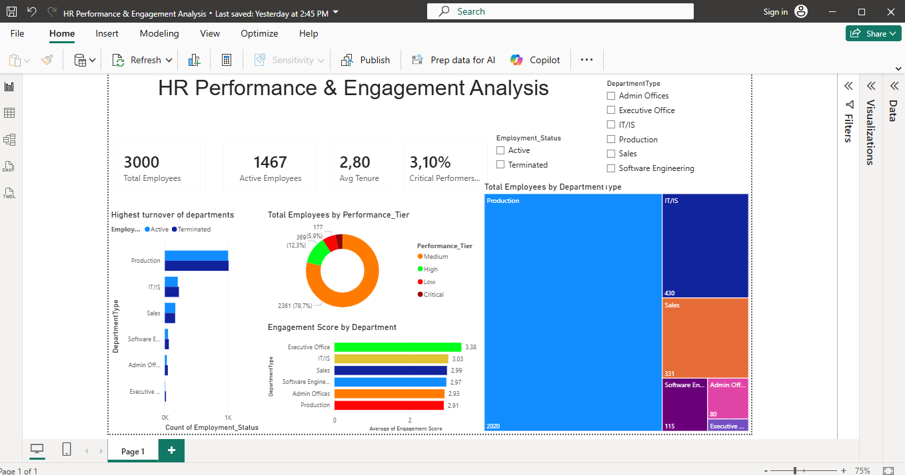

 HR Performance & Engagement Analysis

 📊 Project Overview
This project analyzes HR data for a company of 3,000 employees to identify trends in employee performance, engagement, and turnover across departments. The goal was to help HR teams make data-driven decisions about workforce management and employee retention.

---

 🛠️ Tools Used
- SQL — data cleaning, filtering, and aggregation
- Power BI — interactive dashboard and data visualization

---

📁 Dataset
- 3,000 employee records
- Fields include: Department, Employment Status, Performance Tier, Tenure, and Engagement Score

---

🔍 Key Findings

- 78.7% of employees fall in the Medium performance tier, with only 5.9% classified as Critical Performers
- Production department has the highest employee turnover rate compared to all other departments
- Executive Office leads in employee engagement with an average score of 3.38, while Production has the lowest at 2.91
- Average employee tenure across the company is 2.80 years
- 1,467 out of 3,000 employees are currently active

---

## 💡 Business Recommendations

1. Focus retention efforts on the Production department — it has both the highest turnover and the lowest engagement score, suggesting a workplace culture or workload issue that needs attention
2. Investigate what Executive Office is doing differently — their engagement score is significantly higher than other departments; their practices could be replicated elsewhere
3. Develop a critical performer programme — only 5.9% of staff are critical performers; identifying and retaining these employees should be a priority

---

## 📸 Dashboard Preview

---

## 👤 Author
Aspiring Data Analyst | SQL • Power BI
📍 South Africa | Open to remote opportunities
